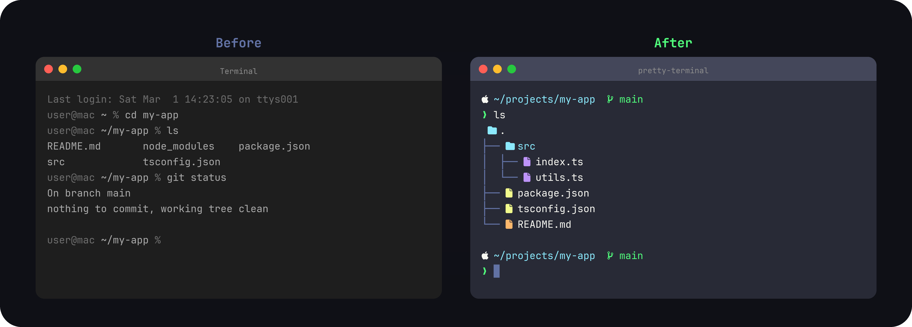

<p align="center">
  
</p>

# pretty-terminal

One command to make your terminal beautiful. Works on macOS, Windows, and Linux.

## What You Get

- **JetBrainsMono Nerd Font** — Beautiful monospace font with icon support (or D2CodingLigature Nerd Font Mono for Korean)
- **eza** — Modern, colorful file listing with icons and tree view
- **Oh My Zsh + Powerlevel10k** (macOS/Linux) — Clean, minimal prompt with git status
- **Oh My Posh** (Windows) — Modern shell prompt with themes

<p align="center">
  
</p>

## Quick Start

### Using an LLM (Recommended)

Paste this into Claude, ChatGPT, or any AI assistant:

```
Clone https://github.com/wjgoarxiv/pretty-terminal to my home directory and run the installer for my operating system.
```

The AI will handle the rest automatically.

### Manual Install

**macOS / Linux:**
```bash
git clone https://github.com/wjgoarxiv/pretty-terminal.git ~/pretty-terminal
bash ~/pretty-terminal/install.sh
```

**Windows (PowerShell):**
```powershell
git clone https://github.com/wjgoarxiv/pretty-terminal.git $HOME\pretty-terminal
& $HOME\pretty-terminal\install.ps1
```

After installation, restart your terminal.

## What Gets Installed

| Component | macOS | Linux | Windows |
|-----------|:-----:|:-----:|:-------:|
| JetBrainsMono Nerd Font | ✓ | ✓ | ✓ |
| eza (modern ls) | ✓ | ✓ | ✓ |
| Oh My Zsh | ✓ | ✓ | — |
| Powerlevel10k | ✓ | ✓ | — |
| Oh My Posh | — | — | ✓ |

## Supported Terminals

- **macOS**: iTerm2, Ghostty (automatic config), Terminal.app (font auto-applied via AppleScript). Other terminals: set font manually in preferences.
- **Linux**: Ghostty (automatic config applied); for GNOME Terminal, Konsole, and other terminals, set JetBrainsMono Nerd Font manually in your terminal preferences
- **Windows**: Windows Terminal (recommended)

The installer detects your OS and installs components compatible with your system.

## Installation Options

The installer provides these options (add as flags to `install.sh` or `install.ps1`):

| Option | Description |
|--------|-------------|
| `--font-only` | Install only the Nerd Font, skip other components |
| `--font d2coding` | Use D2CodingLigature Nerd Font Mono instead of JetBrainsMono (Korean support) |
| `--no-theme` | Skip theme and shell configuration |
| `--uninstall` | Restore original shell configs from backups |

### macOS / Linux Example:
```bash
bash ~/pretty-terminal/install.sh --font-only
bash ~/pretty-terminal/install.sh --font d2coding    # Use Korean font
```

### Windows Example:
```powershell
& $HOME\pretty-terminal\install.ps1 -FontOnly
& $HOME\pretty-terminal\install.ps1 -Font d2coding   # Use Korean font
```

## What the Installer Does

### On macOS / Linux

1. **Downloads and installs JetBrainsMono Nerd Font** to `~/.local/share/fonts` (Linux) or `~/Library/Fonts` (macOS)
2. **Installs eza** via your system package manager:
   - macOS: Homebrew (`brew install eza`)
   - Ubuntu/Debian: APT with custom repo
   - Fedora/RHEL: DNF
   - Arch: Pacman
3. **Installs Oh My Zsh** (if not already present)
4. **Installs Powerlevel10k** theme
5. **Sets zsh as default shell**
6. **Backs up existing shell configs** (`.zshrc`, `.bashrc`, etc.) with `.bak` suffix

### On Windows

1. **Downloads and installs JetBrainsMono Nerd Font** to user fonts directory
2. **Installs Scoop package manager** (if not present)
3. **Installs eza via Scoop**
4. **Registers font in Windows registry** for system-wide availability

## Uninstall

To restore your original terminal configuration:

**macOS / Linux:**
```bash
bash ~/pretty-terminal/install.sh --uninstall
```

**Windows:**
```powershell
& $HOME\pretty-terminal\install.ps1 -Uninstall
```

This restores backed-up configs and removes installed packages (if you choose).

## Troubleshooting

### Font not showing in terminal

1. **Restart your terminal** after installation
2. **Select JetBrainsMono Nerd Font** (or D2CodingLigature Nerd Font Mono if installed with `--font d2coding`) in terminal preferences
3. On **Windows**: Restart Windows Terminal after font installation
4. On **macOS Terminal.app**: Go to Terminal > Settings > Profiles > select your profile > click "Change..." next to Font > search for "JetBrainsMono Nerd Font" (or "D2CodingLigature Nerd Font Mono" if using `--font d2coding`)

### Command not found: eza

1. Verify installation: `eza --version`
2. If missing, run installer again
3. On **macOS**: Ensure Homebrew is installed (`brew --version`)
4. On **Windows**: Ensure Scoop is installed (`scoop --version`)

### Permission denied on install.sh

Run with bash explicitly:
```bash
bash ~/pretty-terminal/install.sh
```

Or make it executable first:
```bash
chmod +x ~/pretty-terminal/install.sh
bash ~/pretty-terminal/install.sh
```

## Customization

### eza Aliases

Once installed, these aliases are available:

```bash
ls   # eza --tree --icons --level=1
ll   # eza -la --icons
lt   # eza --tree --icons
la   # eza -a --icons
```

Add your own aliases by editing `~/.zshrc` (macOS/Linux) or PowerShell profile (Windows).

### Powerlevel10k Configuration

Run the Powerlevel10k wizard anytime:

```bash
p10k configure
```

This opens an interactive configuration wizard for customizing your prompt.

## System Requirements

- **macOS**: 10.14+
- **Linux**: Ubuntu 18.04+, Fedora 32+, Arch, or compatible distro
- **Windows**: Windows 10 21H2+ (Windows 11 recommended)
- **Bash/Zsh** (macOS, Linux) or **PowerShell 7+** (Windows)

## Contributing

Found an issue? Have a suggestion?

1. Check existing issues on GitHub
2. Open a new issue with details about your OS and terminal
3. Include the output of `bash ~/pretty-terminal/install.sh` or `& $HOME\pretty-terminal\install.ps1`

## License

MIT License — see LICENSE file for details.

---

**Made with ❤️ to make your terminal beautiful.**
